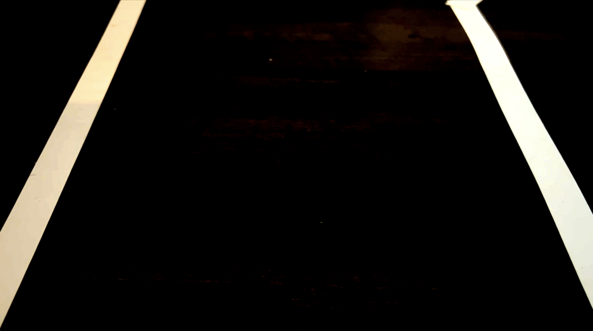
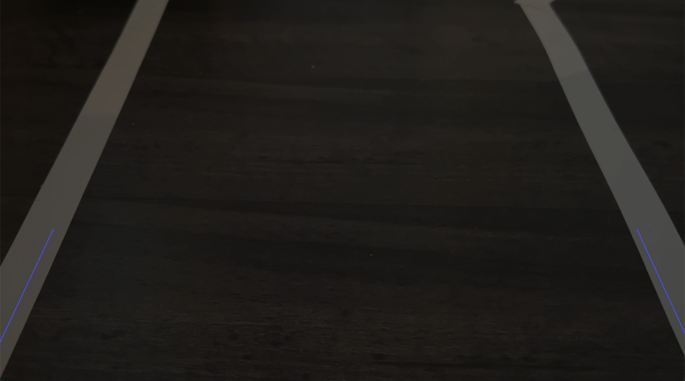
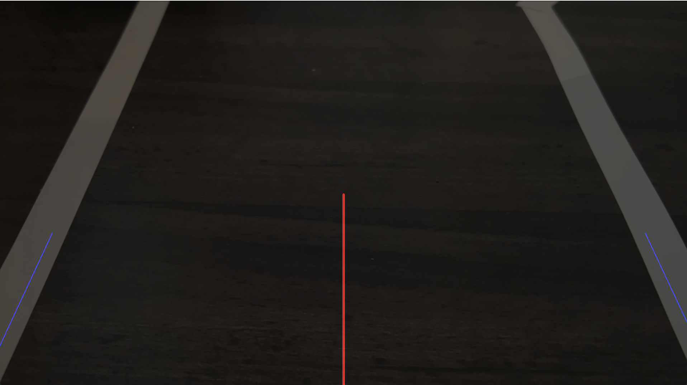
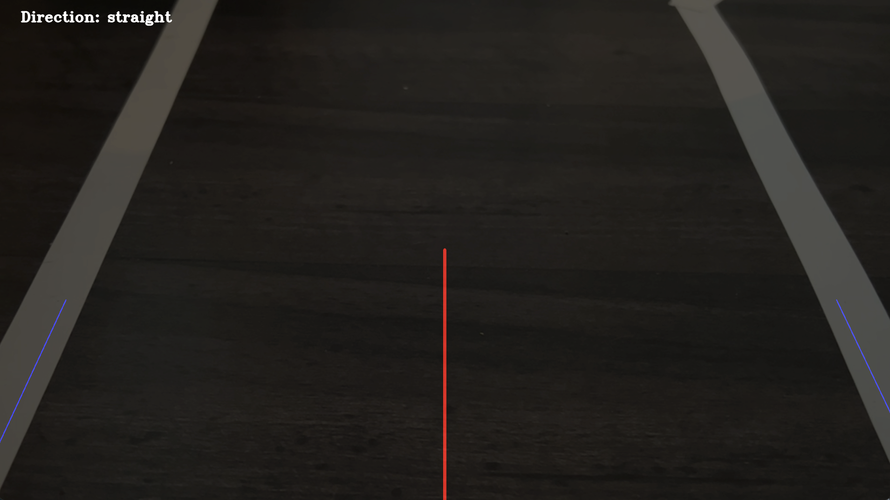

# AI Powered Autonomous Vehicle
This project was completed as part of the capstone for the Grand Canyon University 
graduate program. The below documentation outlines the 
structure and execution of the program with a test video and fully trained AI model
to demonstrate functionality. The original project was 
completed with an Arduino based vehicle, the code for 
which has been included in this repository.

## Table of Contents
[Presentation](#presentation)

[Project Background](#project-background)

[Project Approach](#project-approach)

[User Instructions](#user-instructions)

## Presentation
[Final Presentation Video Link](https://www.youtube.com/watch?v=N61lNMnK5ZU)

## Project Background
The purpose of this project was to explore computer vision and artificial intelligence in the context of autonomous vehicles. Since the onset of self-driving cars and trucks replacing human driven ones is believed to be rapidly approaching, the construction of a computer vision and AI powered autonomous vehicle was decided upon to explore their capabilities, their advantages and shortfalls, as well as their feasibility to build on a smaller scale.

## Project Approach
The software portion of the autonomous vehicle utilizes an object-oriented approach for both the edge detection portions and AI portions of the project. It depends on the user to input a command to determine which mode the program will run in.

### Drive Controller
The `drive_controller.py` serves as the main entry point for the autonomous vehicle program. Users have the choice between four arguments to pass into the program when running the command.

* `edge`: if the user has a working prototype with Arduino microcontroller, this command runs the prototype using computer vision based edge detecting algorithms.
* `learned`: after running the `edge` command a number of times, the user should have amassed a good number of training images. Running this command will train the built-in neural network and run the prototype using the trained model.
* `demo_edge`: this command runs the edge detection algorithms with a sample video. This is meant for users wishing to execute the code, but do not have a working prototype.
* `demo_learn`: this command is meant to be run after the `demo_edge` command to train the built-in neural network using sample frames and directions from the sample video. For the purposes of the demo and for the convenience of the user, a trained model, `driver_model.h5`, has also been included in this repo, making the training of the neural network optional.

### Edge Detection
The file `edge_detecion.py` houses the algorithms used to detect lanes on the road and determine which direction the vehicle should go. This file is only active using the `edge` and `demo-edge` commands. The edge detection portion of the project features a series of OpenCV functions that manipulates and crops the video to focus on a specific region of the screen. 

The frame then has Canny Edge Detection algorithms run that scan the frame looking for high concentrations of gradient, which the algorithm determines as edges. In a well cropped and isolated frame, these edges should be the two lanes on the road. 

After detecting edges, a Hough Transformation is performed on the image in order to extract lines from the image and determine the best fit lines to describe the edges on the screen. 

The center of the frame is also determined in order to find the proper direction the car should be steering. 

If either of the Hough Lines cross the center, an appropriate direction signal is passed back `drive_controller.py`, which in turn sends the command to the Arduino.

### Neural network
The file `neural_network.py` contains the logic to gather data and train a convolutional neural network (CNN). A CNN was chosen due to its ability to find and isolate commonalities in data for classification purposes. This algorithm is ideal for classifying image data and can commonly be found object detection, facial recognition, and self-driving vehicle related algorithms. The training data in this file is saved with a unique frame number with the direction command, encoded as an integer, appended to the end of the file name. The training data is processed one frame at a time and the input feature with the direction command is popped off the file name and both are sent into the CNN to train the model. 

An animated GIF compilation of a set of training data.

The model will output a file called `drive_model.h5`, which, after the neural network has finished training, `drive_controller.py` will use to send appropriate steering commands to the Arduino.

## User Instructions

In order to run this program properly, the user will need to have installed

* Python 3.9
* OpenCV
* Tensorflow/Keras

### Running without an Arduino prototype
#### For convenience, a pre-trained model with a sampling of demo data has been included in this repository. The user does not need to collect training data or train the model in order to run the program.
If the user does not have an Arduino prototype and merely wishes to run the code with sample data, the below commands can be executed:

`python3 drive_controller.py demo_edge`

This command reads frames from the video file `./project_images/demo-video.mov` and run the same algorithms over the video that are used with the prototype. To terminate the program before the video ends, press `q`.

To train the neural network using the sample video, run the above command several more times, and then run:

`python3 drive_controller.py demo_learn`

This will train the neural network using the previously acquired training data and begin to run the program. As in the above instance, line 143 can be commented out in `drive_controller.py` to skip the training step.

### Running with an Arduino prototype
In the root directory, run the command:

`python3 drive_controller.py edge`

This will run the prototype using edge detection, while saving training data. To terminate the program, press `q`. Run this command several more times in order to acquire enough training data to adequately train the neural network.

Once enough training data is acquired, run the command:

`python3 drive_controller.py learned`

This will use the previously acquired training data to build the CNN model. After training, the prototype will begin to run using the trained model. Press `q` to terminate the program. After the model is trained, line 71 in `neural_network.py` can be commented out to skip the training step.

Sample Video: 
[Zion Nationalpark - Scenic Drive, Utah - Full Ride - Onboard Front View](https://www.youtube.com/watch?v=rXKt0qhFN-Y)